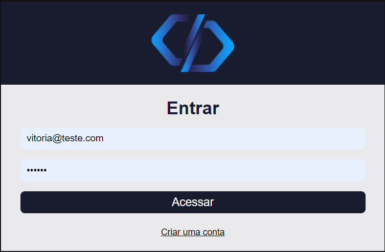
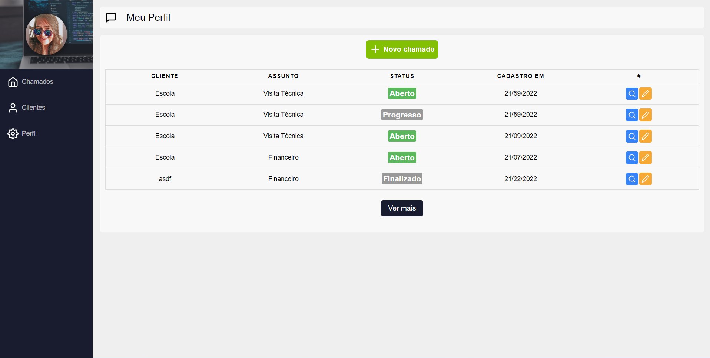
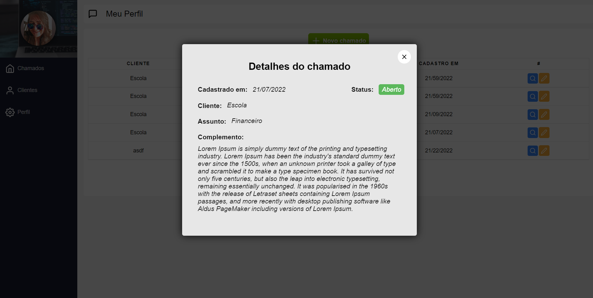
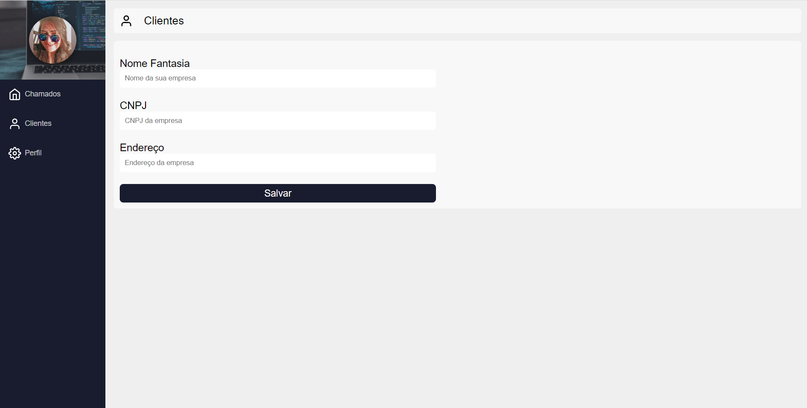
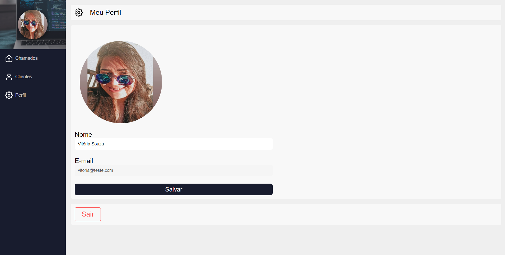

# Ticket System

## ✨ Sobre o projeto

O Projeto é um sistema de chamados onde o usuário se cadastra na plataforma e pode adicionar novos clientes e chamados. Verificar/atualizar os status dos chamados. Editar o seu perfil, adicionando imagem. Consegue ver a lista de chamados e clicando em um deles, abre-se um modal com todas as informações do chamado.

## 🖥 Layout

## 🚀 Tecnologias

Esse projeto foi desenvolvido com as seguintes tecnologias:

- [React](https://reactjs.org)
- [TypeScript](https://www.typescriptlang.org/)
- [Firebase](https://firebase.google.com/)

## 💻 Como executar

1. Clone o repositório
   `git clone https://github.com/SouzaVitoria/Ticket-System.git`

2. Para rodar o projeto, rode `npm start` no terminal
   > No terminal irá mostrar em qual endereço que o projeto estará rodando, e automaticamente abrirá no seu navegador.

## 📚 Ferramentas, Bibliotecas e Pacotes

- [**React Toastify**](https://www.npmjs.com/package/react-toastify): Popup de alertas (sucesso, info, erro, etc)
- [**DATE FNS**](https://www.npmjs.com/package/date-fns): Formatação de datas

## 👨🏻‍💻 Contribuição

Quer contribuir com este projeto? Então siga os passos abaixo:

1. Realize o fork do projeto
2. Crie sua branch (git checkout -b feature/AmazingFeature)
3. Faça o commit das suas modificações/criações (`git commit -m 'Add some AmazingFeature'`)
4. Publique a branch (git push origin feature/AmazingFeature)
5. Abra uma Pull Request

## 📄 Licença

Este projeto não utiliza nenhum tipo de licença.
